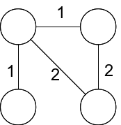

**Due: Wednesday, April 20nd in class** Late assignments will be penalized 20% per day.

Book Questions from *Introduction to Algorithms - 3rd ed.*
==========================================================

23.1-2, 23.2-4, 23.2-5, 24.1-1, 24.3-1

*Hints:*

> 23.1-2 - Consider the following graph
>
> 
>
> 23.2-4 - Note that the running time of Kruskal's algorithm is given by
>
> 
>
> But since |*E*| \< |*V*2|, O(lg *E*) = O(lg *V*2) = O(2 lg *V*) = O(lg *V*) and hence O(*E* lg *E*) = O(E lg V). Which parts can be improved if we know the range of edge weights?
>
> 23.2-5 - Note that the running time of Prim's algorithm is given by
>
> 
>
> Consider using an array rather than a heap. How does this affect the above parts when the range of weights in known?

